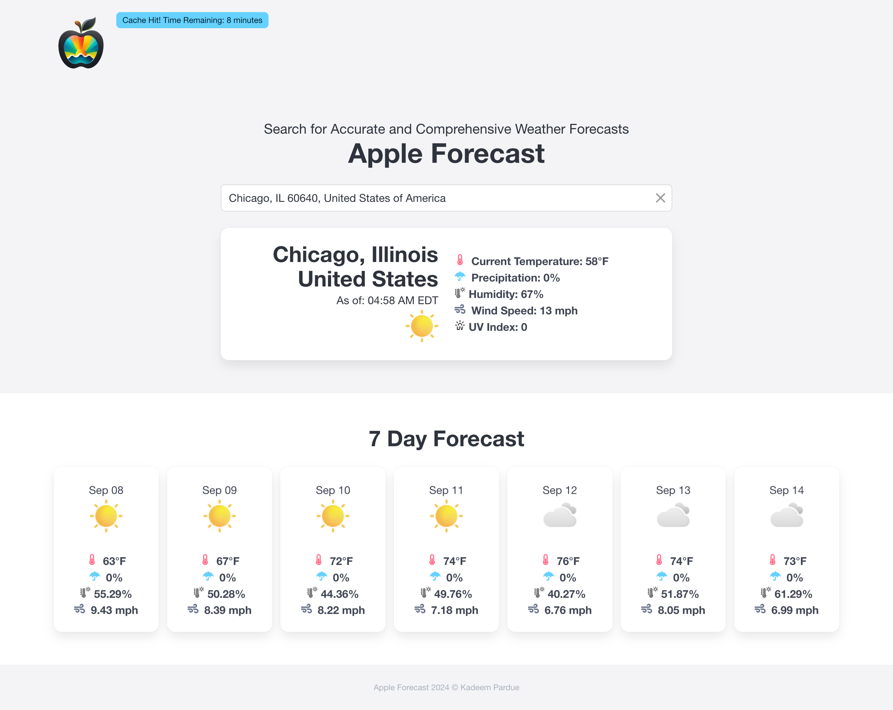

# Apple Forecast



Apple Forecast is an application that accepts an address and generates the weather forecast.

## Installation

Homebrew
```bash
/bin/bash -c "$(curl -fsSL https://raw.githubusercontent.com/Homebrew/install/HEAD/install.sh)"
```

gpg2: OpenPGP encryption and signing tool
```bash
brew install gpg2
```

RVM
```bash
curl -sSL https://get.rvm.io | bash -s stable
```

zlib: General-purpose lossless data-compression library
```bash
brew install zlib@1.3.1 # brew reinstall zlib@1.3.1
```

Ruby Version 3.3.5
```bash
rvm install 3.3.5 --with-zlib-dir=/usr/local/Cellar/zlib/1.3.1
```

Setup gemset
```bash
rvm gemset create rails6.1.7
rvm use 3.3.5@rails6.1.7
```

Install bundler
```bash
gem install bundler -v 2.5.16
```

Bundle gems
```bash
bundle install
```

Create Databases, Run Migrations and Seed
```bash
bundle exec rake db:seed:danger
```

## Running Application

[Terminal Tab 1] Start Services
```bash
docker compose up
```

Note: Your database will be destroyed anytime you run docker compose down.

[Terminal Tab 2] Start Application
```bash
rails s
```

[Browser Tab 1] Application: `http://localhost:3000`

[Browser Tab 2] Database Management: `http://localhost:8080`

System: `PostgreSQL`
Server: `postgres`
Username: `postgres`
Password: `postgres`
Database: `appleforecast_development` or `appleforecast_test`

## Notes

Caching is supported. We cache forecasts for 30 minutes.
An indicator will pop up next to the logo showing that a cache has been hit.

We are limited to 25 new forecasts per hour (300 per day).

## Contributing

Pull requests are welcome. For major changes, please open an issue first
to discuss what you would like to change.

Please make sure to update tests as appropriate.

## License

MIT License

Copyright (c) [2024] [Kadeem Pardue]

Permission is hereby granted, free of charge, to any person obtaining a copy
of this software and associated documentation files (the "Software"), to deal
in the Software without restriction, including without limitation the rights
to use, copy, modify, merge, publish, distribute, sublicense, and/or sell
copies of the Software, and to permit persons to whom the Software is
furnished to do so, subject to the following conditions:

The above copyright notice and this permission notice shall be included in all
copies or substantial portions of the Software.

THE SOFTWARE IS PROVIDED "AS IS", WITHOUT WARRANTY OF ANY KIND, EXPRESS OR
IMPLIED, INCLUDING BUT NOT LIMITED TO THE WARRANTIES OF MERCHANTABILITY,
FITNESS FOR A PARTICULAR PURPOSE AND NONINFRINGEMENT. IN NO EVENT SHALL THE
AUTHORS OR COPYRIGHT HOLDERS BE LIABLE FOR ANY CLAIM, DAMAGES OR OTHER
LIABILITY, WHETHER IN AN ACTION OF CONTRACT, TORT OR OTHERWISE, ARISING FROM,
OUT OF OR IN CONNECTION WITH THE SOFTWARE OR THE USE OR OTHER DEALINGS IN THE
SOFTWARE.